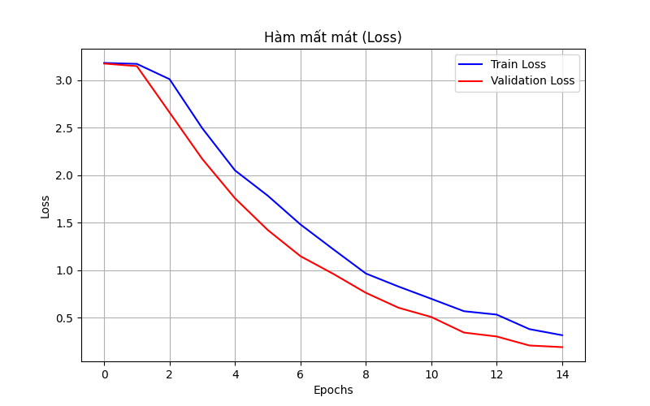

# 🤟 Hệ thống Nhận diện Ngôn ngữ Ký hiệu (Sign Language Recognition System)

> **Đồ án I - Kỹ thuật Máy tính - Đại học Bách Khoa Hà Nội (HUST)**
>
> **Sinh viên:** Nguyễn Đào Nam Hải
> **MSSV:** 20235321
> **Lớp:** IT3150


## 📖 Giới thiệu (Overview)

Dự án này xây dựng một hệ thống **AI + IoT** hỗ trợ giao tiếp cho người khiếm thính. Hệ thống sử dụng Camera máy tính để nhận diện 26 chữ cái ngôn ngữ ký hiệu Mỹ (ASL) theo thời gian thực và truyền kết quả hiển thị xuống vi điều khiển **ESP32** thông qua giao thức HTTP/Wi-Fi.

Mục tiêu là tạo ra một thiết bị hiển thị nhỏ gọn, giao diện thân thiện, giúp chuyển đổi cử chỉ tay thành văn bản ngay lập tức.


*(Hình ảnh giao diện thực tế khi nhận diện chữ cái)*

---

## 🚀 Tính năng nổi bật (Key Features)

* **⚡ Xử lý thời gian thực:** Tốc độ 25-30 FPS nhờ kỹ thuật Đa luồng (Multi-threading).
* **🧠 Deep Learning:** Sử dụng mạng Nơ-ron Tích chập (CNN) được huấn luyện trên dataset ASL.
* **📡 IoT Streaming:** Truyền video mượt mà từ PC xuống ESP32 (MJPEG Streaming).
* **🎨 Giao diện Glassmorphism:** Thiết kế UI hiện đại, thân thiện trên màn hình web.
* **🔄 Đồng bộ dữ liệu:** ESP32 tự động cập nhật kết quả nhận diện liên tục.

---

## 📂 Cấu trúc thư mục (Project Structure)

Dựa trên cấu trúc mã nguồn thực tế:

```text
IT3150_PROJECT_I_SIGNLANGUAGE/
├── docs/                       # Tài liệu báo cáo (PDF)
├── esp32/
│   └── web/
│       ├── web.ino             # Code nạp cho mạch ESP32
│       └── web_interface.h     # Chứa mã HTML/CSS giao diện
├── pc/                         # --- MÃ NGUỒN CHÍNH TRÊN MÁY TÍNH ---
│   ├── dataset/                # Dữ liệu ảnh sau khi xử lý
│   ├── model/                  # Chứa model.tflite và labels.json
│   ├── raw_data/               # Dữ liệu thô (asl_alphabet_train)
│   ├── static/                 # Tài nguyên tĩnh (ảnh hướng dẫn, icon)
│   ├── prepare_dataset.py      # Code tiền xử lý dữ liệu
│   ├── train_model.py          # Code huấn luyện mô hình AI
│   ├── run_system.py           # Code SERVER chạy hệ thống
│   ├── realtime_detect.py      # Module nhận diện thời gian thực
│   ├── accuracy_chart.png      # Biểu đồ độ chính xác (tự sinh ra khi train)
│   └── loss_chart.png          # Biểu đồ hàm mất mát (tự sinh ra khi train)
├── requirements.txt            # Danh sách thư viện Python
└── README.md                   # Tài liệu hướng dẫn này
```

## ⚙️ Hướng dẫn cài đặt (Installation)

### 1. Thiết lập môi trường trên PC
Cài đặt các thư viện Python cần thiết:
```bash
pip install tensorflow opencv-python flask numpy matplotlib seaborn scikit-learn
```

### 2. Chuẩn bị dữ liệu và Huấn luyện
Nếu bạn chưa có file model trong thư mục pc/model/, hãy thực hiện lần lượt:

Đảm bảo dataset đã được giải nén vào pc/raw_data/.

Chạy script tiền xử lý:
```bash
python pc/prepare_dataset.py
```

Chạy script huấn luyện mô hình (khoảng 15-20 phút):
```bash
python pc/train_model.py
```

Sau bước này, file model.tflite, accuracy_chart.png và loss_chart.png sẽ được tạo ra trong thư mục pc/.

### 3. Cài đặt cho ESP32
Mở file esp32/web/web.ino bằng Arduino IDE.

Chỉnh sửa tên Wifi và Mật khẩu trong code:

C++

const char* ssid = "TEN_WIFI_CUA_BAN";
const char* password = "MAT_KHAU_WIFI";
Kết nối ESP32 với máy tính và nhấn nút Upload.

## ▶️ Hướng dẫn chạy hệ thống (Usage)

### Bước 1: Chạy Server trên máy tính: Từ thư mục gốc, chạy lệnh:
```bash
python pc/run_system.py
```

Màn hình sẽ hiện thông báo: Server đang chạy tại: http://192.168.1.XX:5000

### Bước 2: Khởi động ESP32

Cấp nguồn cho ESP32.

Mở Serial Monitor (Baud 115200) để xem địa chỉ IP mà ESP32 nhận được (ví dụ: 192.168.1.73).

### Bước 3: Trải nghiệm

Mở trình duyệt truy cập vào IP của ESP32.

Đưa tay vào khung camera để hệ thống nhận diện.

## 📊 Kết quả thực nghiệm (Results)
### 1. Hiệu suất mô hình
Biểu đồ được sinh ra sau quá trình huấn luyện:

<p float="left">   </p>

### 2. Giao diện người dùng
(Vui lòng chụp ảnh màn hình giao diện Web khi chạy và lưu file tên web_ui_detection.jpg tại thư mục gốc để hiển thị tại đây)

👨‍💻 Liên hệ
Nguyễn Đào Nam Hải

Email: namhai23092005@gmail.com

Github: https://github.com/NamHaiIT2HUST
