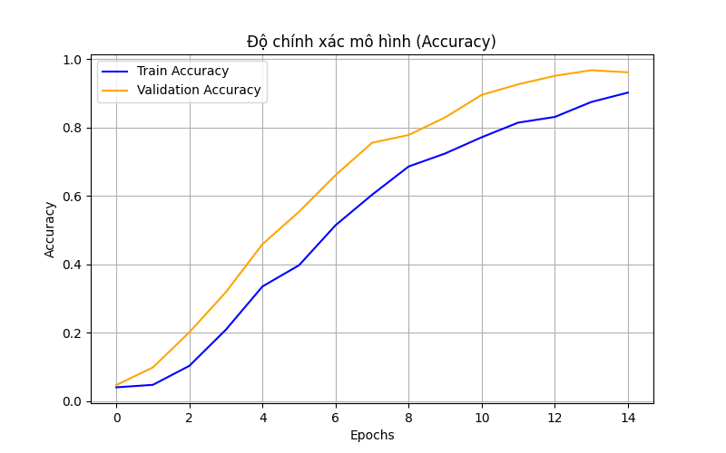
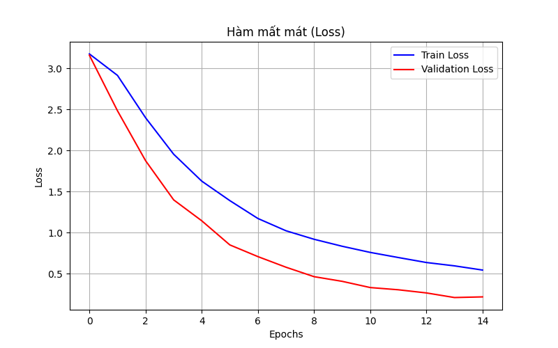

# 🤟 Hệ thống Nhận diện Ngôn ngữ Ký hiệu (Sign Language Recognition System)

> **PROJECT I - Kỹ thuật Máy tính_03 K68 - Đại học Bách Khoa Hà Nội (HUST)**
>
> **Sinh viên:** Nguyễn Đào Nam Hải
> **MSSV:** 20235321
> **Lớp:** 755566


## 📖 Giới thiệu (Overview)

Dự án xây dựng hệ thống **Edge AI + IoT** hỗ trợ giao tiếp cho người khiếm thính: nhận diện 24 chữ cái tĩnh
trong ngôn ngữ ký hiệu Mỹ (ASL, không gồm J và Z vì 2 ký hiệu này cần chuyển động) theo thời gian thực.

**Kiến trúc v2 (hiện tại) — Edge AI đúng nghĩa:** camera + suy luận CNN (TensorFlow Lite Micro, int8) chạy
**ngay trên chip ESP32-S3-CAM**, không phụ thuộc PC lúc vận hành thực tế. PC chỉ đóng vai trò server trung
tâm host dashboard web, nhận kết quả từ thiết bị edge. Đây là bản redesign từ kiến trúc v1 (PC làm toàn bộ
suy luận rồi gửi kết quả cho ESP32 tự host web server) — kiến trúc v1 được lưu trữ tại git tag
[`v1-pc-server-esp32-display`](../../releases/tag/v1-pc-server-esp32-display) và thư mục `legacy_v1/` để
tham khảo (đây là kiến trúc trong báo cáo `docs/HaiNDN_20235321_Report_ProjectI.pdf` đã nộp).


*(Ảnh giao diện dashboard — chụp từ kiến trúc v1, sẽ cập nhật lại khi có ảnh dashboard v2)*

---

## 🚀 Tính năng nổi bật (Key Features)

* **🧠 On-device Inference:** CNN lượng tử hoá int8 chạy trực tiếp trên ESP32-S3-CAM bằng TensorFlow Lite Micro — không cần PC lúc nhận diện.
* **📡 Kiến trúc Edge AI chuẩn:** Edge node (ESP32-S3-CAM) chỉ cảm biến + suy luận + gửi JSON nhỏ; PC (máy khỏe) host dashboard — đúng vai trò từng bên.
* **🎨 Dashboard thời gian thực:** Flask server hiển thị ký tự, độ tin cậy, lịch sử ghép chữ, tự động commit khi giữ ký hiệu ổn định.
* **🔬 Pipeline train + quantize hoàn chỉnh:** từ ảnh Kaggle ASL Alphabet đến model int8 nhúng firmware, kèm công cụ thu thập dữ liệu hiệu chỉnh từ chính camera OV2640 để giảm domain shift.

---

## 📂 Cấu trúc thư mục (Project Structure)

```text
IT3150_PROJECT_I_SIGNLANGUAGE/
├── docs/                            # Báo cáo PDF (mô tả kiến trúc v1 đã nộp)
├── esp32/
│   ├── edge_inference/              # --- FIRMWARE CHÍNH THỨC (v2) ---
│   │   ├── edge_inference.ino       # Capture + tiền xử lý + suy luận TFLite Micro + POST kết quả
│   │   ├── camera_pins.h            # Pin mapping camera OV2640 (board ESP32-S3-CAM)
│   │   ├── roi_config.h             # Cấu hình kích thước khung hình/ROI/input model
│   │   └── model_data.h             # Model đã quantize, sinh tự động bởi pc/convert_to_c_array.py
│   ├── tools/
│   │   └── capture_mode.ino         # Sketch tạm: thu thập dữ liệu hiệu chỉnh từ camera thật
│   └── legacy_v1/                   # Firmware kiến trúc v1 (ESP32 tự host web server) — lưu tham khảo
├── pc/                               # --- MÃ NGUỒN TRÊN MÁY TÍNH ---
│   ├── dataset/                     # Dữ liệu ảnh Kaggle sau tiền xử lý
│   ├── dataset_calibration/         # Dữ liệu hiệu chỉnh chụp từ chính ESP32-S3-CAM (Phase 3)
│   ├── model/                       # model.tflite (int8) + labels.json
│   ├── legacy_v1/                   # Server v1 (PC làm inference) — lưu tham khảo
│   ├── prepare_dataset.py           # Tiền xử lý dữ liệu Kaggle (resize 48x48)
│   ├── train_model.py               # Train CNN gọn + quantize int8 -> model.tflite
│   ├── convert_to_c_array.py        # model.tflite -> esp32/edge_inference/model_data.h
│   ├── collect_calibration_set.py   # Thu thập ảnh hiệu chỉnh qua esp32/tools/capture_mode.ino
│   ├── server.py                    # SERVER TRUNG TÂM (v2): nhận /predict, host dashboard
│   ├── templates/index.html         # Giao diện dashboard
│   └── static/                      # CSS + ảnh tĩnh (bảng ký hiệu, biểu đồ)
├── requirements.txt
└── README.md
```

---

## ⚙️ Hướng dẫn cài đặt (Installation)

### 0. Phần cứng cần có
- **ESP32-S3-CAM** (khuyến nghị Freenove ESP32-S3-WROOM CAM, có PSRAM) — bắt buộc để chạy on-device inference. ESP32 DevKit thường (không camera) **không đủ** cho kiến trúc v2.
- Trước khi flash: đối chiếu lại `esp32/edge_inference/camera_pins.h` với board thật (pin mapping có thể khác giữa các revision).

### 1. Môi trường Python trên PC
```bash
pip install -r requirements.txt
```

### 2. Chuẩn bị dữ liệu và huấn luyện model (int8)
```bash
python pc/prepare_dataset.py
python pc/train_model.py
python pc/convert_to_c_array.py
```
Sau bước này: `pc/model/model.tflite` (int8) + `pc/model/labels.json`, và
`esp32/edge_inference/model_data.h` đã được sinh sẵn để nhúng vào firmware.

### 3. (Khuyến nghị) Thu thập dữ liệu hiệu chỉnh từ chính camera OV2640
Model train trên ảnh Kaggle có phân phối pixel khác ảnh chụp thật từ ESP32-S3-CAM — nên thu thập
thêm một bộ ảnh hiệu chỉnh trước khi coi model "dùng được" trên thiết bị thật:
1. Nạp `esp32/tools/capture_mode.ino` (sửa `ssid`/`password` trước khi nạp).
2. Lấy IP từ Serial Monitor, chạy cho từng chữ cái:
   ```bash
   python pc/collect_calibration_set.py --esp32-ip <IP> --label A --count 60
   ```
3. Train lại/fine-tune với dữ liệu hỗn hợp Kaggle + `pc/dataset_calibration/`.

### 4. Nạp firmware chính thức lên ESP32-S3-CAM
- Mở `esp32/edge_inference/edge_inference.ino` bằng Arduino IDE.
- Cài thư viện `esp-tflite-micro` (hoặc `Chirale_TensorFlowLite`) qua Library Manager.
- Sửa `ssid`, `password`, và `PC_SERVER_URL` (IP của PC chạy `pc/server.py`) trong code.
- Chọn board ESP32-S3 có PSRAM, bật cấu hình camera tương ứng, nạp code.
- Mở Serial Monitor (baud 115200) để xem IP thiết bị và log FPS/tensor arena.

### 5. Chạy dashboard trên PC
```bash
python pc/server.py
```
Mở trình duyệt tới `http://<PC_IP>:5000`.

---

## ▶️ Luồng hoạt động (Usage flow)

```
[ESP32-S3-CAM]                              [PC - Flask server trung tâm]
  - Chụp ảnh (grayscale, native OV2640)        - Nhận POST /predict {char, confidence}
  - Crop ROI + resize 48x48                    - Ghép chữ, lưu lịch sử
  - Suy luận CNN (TFLite Micro, int8)  --POST-->  - Host dashboard web
  - KHÔNG host web server                      - Trình duyệt người dùng kết nối vào PC
```

Đưa tay vào giữa khung hình camera ESP32-S3-CAM, giữ ổn định ~1 giây để ký tự được ghi vào lịch sử trên dashboard.

---

## 📊 Kết quả thực nghiệm (Results)

Đã chạy thử pipeline v2 (48x48, int8) với dữ liệu Kaggle hiện có trong repo (~100 ảnh/lớp — tập rút gọn,
chưa phải bộ đầy đủ):

| | v1 (64x64, float32) | v2 (48x48, int8) |
|---|---|---|
| Kích thước model | ~1.4 MB | **96.8 KB** |
| Validation accuracy | (xem báo cáo PDF) | **~86%** |

<p float="left">   </p>

Số liệu accuracy này đo trên ảnh Kaggle (`pc/dataset`), **chưa phản ánh** hiệu năng thật trên ảnh chụp từ
camera OV2640 (xem rủi ro domain shift ở mục cài đặt bước 3) và **chưa đo được FPS/latency thật** vì chưa có
board ESP32-S3-CAM để flash — cần cập nhật lại các số liệu này sau khi có phần cứng.

---

## 🕰️ Lịch sử kiến trúc

- **v1** (đã nộp báo cáo): PC chạy webcam + TensorFlow Lite, gửi kết quả cho ESP32 tự host web server. Xem git tag `v1-pc-server-esp32-display`, thư mục `pc/legacy_v1/` và `esp32/legacy_v1/`.
- **v2** (hiện tại): Edge AI on-device trên ESP32-S3-CAM, PC làm server trung tâm.

👨‍💻 Liên hệ
Nguyễn Đào Nam Hải

Email: namhai23092005@gmail.com

Github: https://github.com/NamHaiIT2HUST
